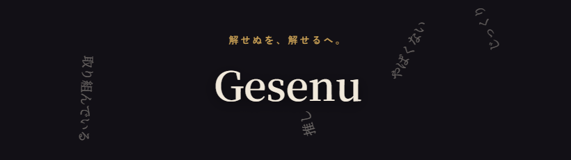
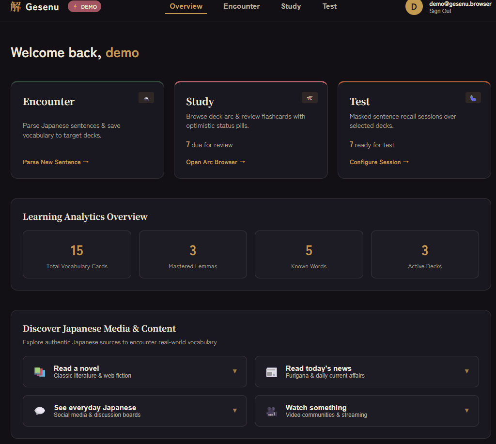

## Gesenu — Learn words where you found them.

  

> 🚧 Active development · [Live on Vercel](https://gesenu.vercel.app/)

Language learning happens everywhere, books, anime, news, games, and more. We believe every unfamiliar word belongs with the context where you found it, not as an isolated dictionary entry. Gesenu captures both the word and its original context, helping you build understanding instead of simply memorizing definitions.

    

        🖼️ Demo GIF
    

    

---

## 🚨 The Problem

Japanese learning often leaves learners struggling with fragmented, fragile vocabulary:

- **Vocabulary is fragmented** — Words encountered across books, anime, news, and social media are difficult to organize without losing the context in which they appeared.
- **Generic lists waste effort** — Studying pre-made vocabulary decks is inefficient because they inevitably mix words you already know with words you don't.
- **Meaning alone is not enough** — Memorizing dictionary definitions in isolation leaves words fragile; without original sentence context and particle usage, words evaporate quickly within days and remain hard to apply in real reading.

---

## 🚀 Key Features

Gesenu follows a simple loop: **Encounter → Study → Test**.

- **Sentence-Driven Capture** — Paste any Japanese sentence. SudachiPy tokenises it, returns dictionary lemmas (走った → 走る), and filters by part of speech so you only see meaningful candidates.
- **Context-Bound Cards** — Jisho enriches each word with meaning, reading and JLPT level. The original sentence stays attached to the card forever.
- **FSM Progress Tracking** — Cards move through an explicit state machine: `New → Learning → Known → Mastered`. Invalid transitions are impossible.
- **Masked Recall Testing** — Active recall by typing the target word back into its original sentence.

---

## 🎨 Key Design Decisions

- **Optimistic Reviews** — The UI updates instantly on every rating. A failed write rolls back visibly instead of drifting silently.
- **Compile-Time Contracts** — TypeScript types are generated from the FastAPI OpenAPI schema at build time. A frontend/backend mismatch fails the build.
- **Scrollytelling Landing** — Native CSS scroll-snap with a persistent canvas particle animation that morphs surface forms into lemmas and finally converges into colour-coded Hanafuda deck stacks.

---

## 🛠️ Tech Stack

| Layer | Stack |
|-------|-------|
| Frontend | React + TypeScript (Vite), Vanilla CSS |
| Backend | FastAPI (Python) |
| Database | Supabase PostgreSQL |
| Parsing | SudachiPy |
| Dictionary | Jisho API |
| Auth | Supabase Auth (in progress) |
| Deployment | Vercel (frontend + backend) |

---

## 🗺️ Current status

| Phase | Status | Scope |
|-------|--------|-------|
| **Design & Planning** | ✅ Done | Pipeline design, data model, scope decisions |
| **Backend Foundation** | ✅ Done | FastAPI, SudachiPy parsing, Jisho lookup, OpenAPI → TS generation, DB schema |
| **Encounter Workflow** | ✅ Done | Sentence input → token parsing → Jisho lookup → save to deck |
| **Study UI & FSM** | ✅ Done | Hanafuda arc deck browser, flashcard session, FSM state pills, optimistic UI |
| **Landing Page** | ✅ Done | Scrollytelling layout, 5-stage canvas animation, deck convergence |
| **Recall Test** | ✅ Done | Masked-sentence fill-in-the-blank session |
| **Auth** | 🔲 In progress | Supabase Auth (social login), protected endpoints |
| **Deployment** | ✅ Live | Frontend + backend on Vercel |

<!-- Add a Quick Start session once containerization is done -->

---

## ⚠️ Limitations

- Gesenu does not explain grammar or provide full-sentence translations.
- Sudachi can split some idioms and fixed expressions into individual tokens.
- It is not intended as a replacement for traditional vocabulary lists aimed at JLPT preparation.

---

## 🎯 Who is Gesenu for?

Gesenu is for **intermediate and advanced learners** who regularly encounter Japanese in authentic material — books, anime, games, news, online discussions.

If you are still building core vocabulary with textbooks, stick with those first. Once you start meeting words in the wild and want them to stick with their original context, Gesenu is for you.

---

*Last updated: 2026-08-08*
